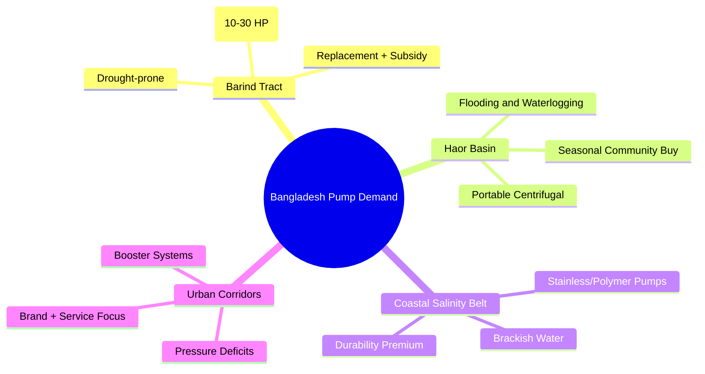
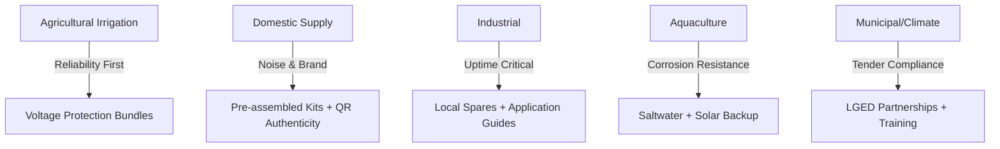
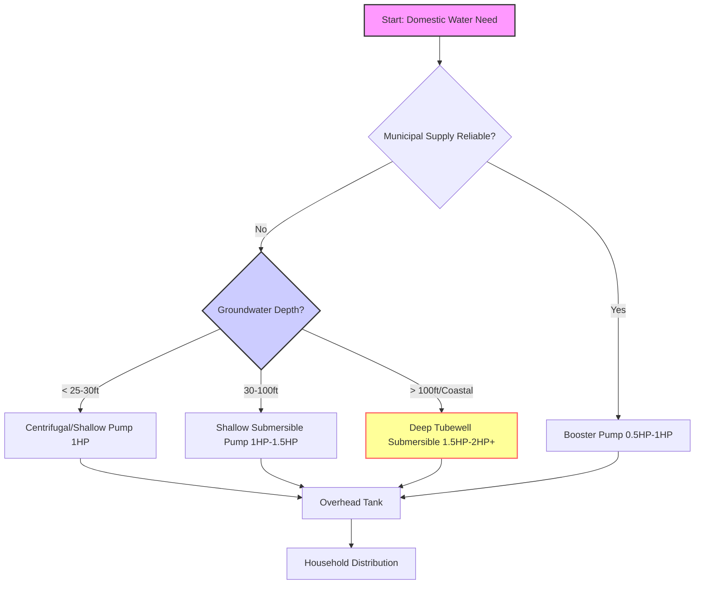
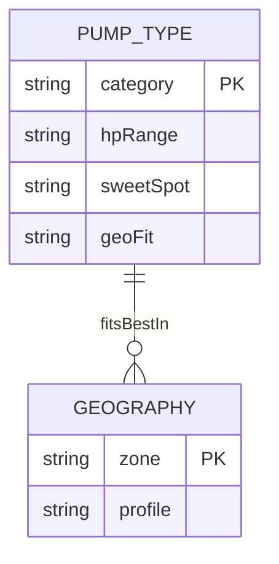
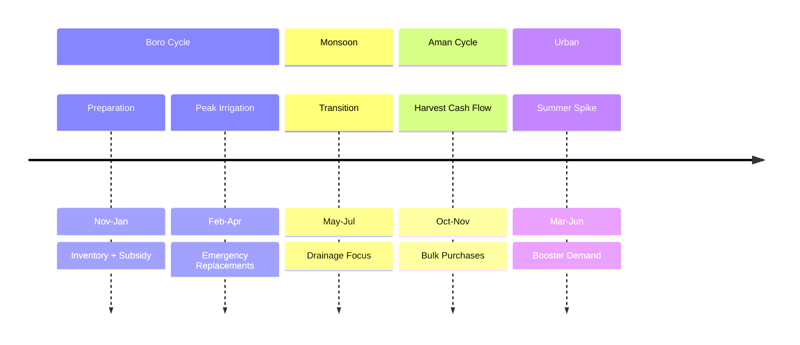
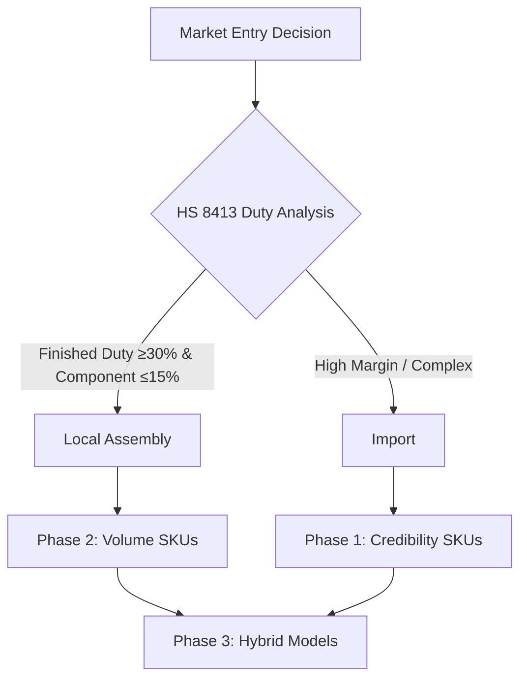
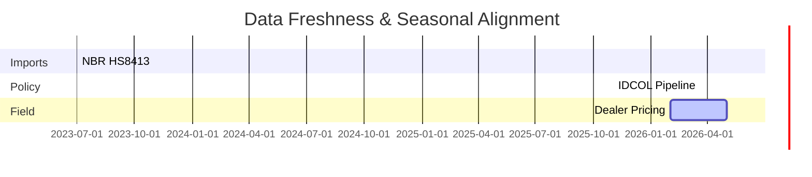
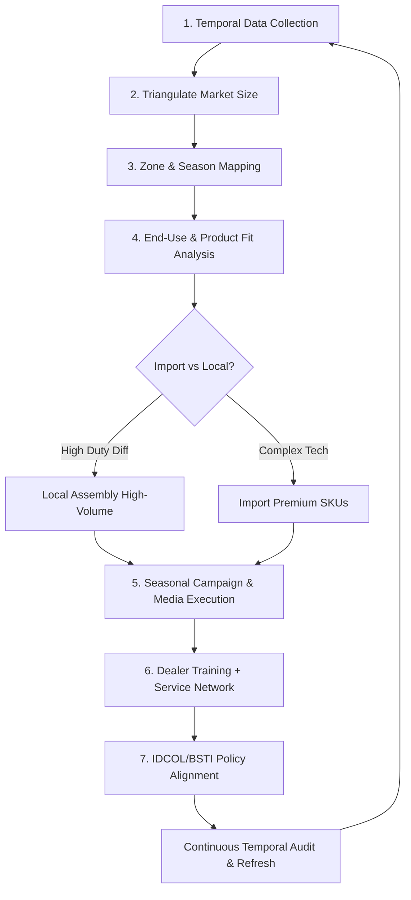

# 🇧🇩 Bangladesh Water Pump Market Landscape — Strategic Ideation Framework for Leo Pump

**Market Entry & Growth Strategy Document**  
*Optimized for Obsidian • Last Updated: May 2026*

## 📈 Market Sizing and Growth Trajectory: Current Valuation and CAGR Projections

The Bangladesh water pump market operates as a multi-layered ecosystem rather than a single unified market. Current valuation estimates must be derived through triangulation methodology due to limited centralized public data.

### Triangulation Framework for Market Valuation

| Signal Source | Methodology | Confidence Weight |
|--------------|-------------|------------------|
| HS Code 8413 Import Data (NBR) | Extract CIF values for centrifugal, submersible, and other liquid pumps; apply 1.2-1.8x multiplier for landed cost to retail markup | High |
| BADC Installed Irrigation Base | Multiply registered deep tube wells and shallow tube wells by estimated 5-7 year replacement cycle | High |
| Dealer Pricing Signals (Daraz, BDStall, regional distributors) | Weighted average pricing × estimated unit sales velocity by region | Medium |
| IDCOL Solar Pump Installation Records | Policy-driven segment tracking with subsidy disbursement data | High |
| Urban Housing Permit Data (RAJUK, CDA, KDA) | Proxy for domestic booster pump demand growth | Medium |

**Growth Trajectory Logic:**

CAGR projections should not be extrapolated from global reports. Instead, apply bottom-up drivers:

- Agricultural: 4-6% CAGR tied to Boro rice area stability, groundwater table trends, and diesel-to-electric transition economics
- Domestic: 8-12% CAGR driven by apartment construction rates, municipal water pressure deficits, and middle-class electrification
- Industrial: 6-9% CAGR linked to export-oriented manufacturing expansion and uptime-critical operations
- Solar: 15-25% CAGR contingent on IDCOL funding cycles, climate adaptation policy, and hybrid system cost reductions

Label all estimates with confidence tiers: High (government source), Medium (trade/distributor), Low (interview/claim).

---

## 🗺️ Agro-Ecological Zone Segmentation: Geographic Demand Differentiation

Bangladesh's pump demand is fundamentally shaped by hydro-climatic zoning. A one-size-fits-all product or distribution strategy will underperform.



**Barind Tract (Northwest: Rajshahi, Naogaon, Chapainawabganj)**

- Hydrological Profile: Drought-prone, declining groundwater table, high irrigation dependency
- Pump Implication: Deep submersible pumps (10-30 HP), corrosion-resistant materials for hard water, voltage-stabilized motors
- Purchase Logic: Replacement-driven, **subsidy-sensitive**, dealer trust critical
- Research Anchor: BADC deep tube well census, Barind Multi-Purpose Development Authority reports

**Haor Basin (Northeast: Sunamganj, Kishoreganj, Netrokona)**

- Hydrological Profile: Seasonal flooding, waterlogging, short dry window for Boro cultivation
- Pump Implication: Portable centrifugal pumps for rapid drainage/irrigation switch, floating pump platforms, salt-tolerant seals
- Purchase Logic: Seasonal cash flow alignment (post-Aman harvest), community bulk procurement
- Research Anchor: Haor Development Board publications, local dealer interviews in Bengali

**Coastal Salinity Belt (Southwest: Khulna, Satkhira, Bagerhat; Southeast: Cox's Bazar, Chattogram)**

- Hydrological Profile: Salinity intrusion, brackish groundwater, cyclone exposure
- Pump Implication: Stainless steel or polymer wetted parts, sealed motor housings, anti-corrosion coatings, elevated installation kits
- Purchase Logic: Institutional tenders (municipal, NGO projects), durability premium acceptance
- Research Anchor: BWDB salinity maps, IDCOL coastal adaptation project data

**Urban Corridors (Dhaka, Chattogram, Gazipur, Narayanganj)**

- Hydrological Profile: Municipal supply intermittency, high-rise water pressure deficits, groundwater extraction restrictions
- Pump Implication: Quiet booster systems, pressure automation controllers, compact jet pumps for rooftop tanks
- Purchase Logic: Brand reputation, after-sales service density, warranty terms, installer network
- Research Anchor: RAJUK/CDA building permit data, e-commerce pricing scrapes (Daraz, Pickaboo)


![[Generated Image May 06, 2026 - 6_07PM.jpg]]

---

## 🏭 End-Use Application Mapping: Demand Logic by Sector



**Agricultural Irrigation (Boro/Aman Cycles)**

- Primary Driver: Food security policy, groundwater access economics, diesel cost volatility
- Decision Hierarchy: Reliability > Fuel Efficiency > Upfront Cost > Brand
- Key Pain Points: Voltage fluctuation burnout, spare part delays, technician skill gaps
- Strategic Opening: Voltage-protected motor bundles, dealer technician certification programs, seasonal financing partnerships

**Domestic Water Supply (Urban/Middle-Class Housing)**

- Primary Driver: Apartment proliferation, municipal pressure deficits, rising water quality awareness, Decreasing water level
- Decision Hierarchy: Noise Level > Electricity Consumption > Brand Trust > Warranty
- Key Pain Points: Installation complexity, service response time, counterfeit product risk
- Strategic Opening: Pre-assembled booster kits, QR-code authenticity verification, urban service hub network


**Industrial Fluid Transfer (Textile, Dyeing, Pharmaceuticals, Food Processing)**

- Primary Driver: Export compliance, production uptime, chemical handling safety
- Decision Hierarchy: Reliability > Downtime Cost > Technical Support > Energy Efficiency
- Key Pain Points: Imported spare part lead times, voltage instability failures, application engineering gaps
- Strategic Opening: Local spare parts inventory, voltage stabilization bundles, application-specific pump selection guides

**Aquaculture & Fisheries (Pond Aeration, Water Exchange, Hatcheries)**

- Primary Driver: Export-oriented shrimp/fish farming, continuous operation requirements
- Decision Hierarchy: Corrosion Resistance > Uninterrupted Duty > Maintenance Frequency > Energy Cost
- Key Pain Points: Salinity-induced seal failure, power outage vulnerability, technical guidance scarcity
- Strategic Opening: Saltwater-rated pump lines, solar-backup integration, bundled service contracts for fish farm clusters

**Municipal & Climate Infrastructure (Drainage, Flood Management, Public Water Supply)**

- Primary Driver: Climate adaptation funding, tender-based procurement, large-scale deployment
- Decision Hierarchy: Compliance Specifications > Lifecycle Cost > Local Service Capacity > Policy Alignment
- Key Pain Points: Tender complexity, payment cycle delays, post-installation maintenance gaps
- Strategic Opening: Pre-qualified tender response templates, LGED partnership frameworks, municipal technician training programs

---

## 🔧 Product-Type Demand Analysis: Technology Fit by Application



**Jet Pumps (Shallow Lift, Domestic/Small Farm Use)**

- Sweet Spot: 0.5-2 HP, 20-50 ft head, single-phase power
- Geographic Fit: Urban domestic, Haor seasonal irrigation, smallholder farms
- Competitive Dynamics: High fragmentation, price-sensitive, brand differentiation emerging
- Leo Pump Positioning: Quiet operation emphasis, voltage protection bundle, installer training for rural dealers

**Submersible Pumps (Deep Groundwater, Agricultural/Industrial)**

- Sweet Spot: 3-30 HP, 100-300 ft head, three-phase or solar-compatible
- Geographic Fit: Barind deep aquifers, coastal saline zones, industrial process water
- Competitive Dynamics: Mid-tier consolidation (RFL, Walton), technical specification competition
- Leo Pump Positioning: Corrosion-resistant variants for coastal, voltage-stabilized controllers, dealer technical certification

**Centrifugal Pumps (Surface Irrigation, Drainage, Industrial Transfer)**

- Sweet Spot: 1-15 HP, high flow rate, portable or fixed installation
- Geographic Fit: Haor floodplain drainage, textile effluent transfer, municipal water supply
- Competitive Dynamics: Import dominance (Chinese), local assembly opportunity
- Leo Pump Positioning: Local assembly of high-volume SKUs, rapid spare parts logistics, application engineering support

**Solar/Hybrid Systems (Policy-Driven, Off-Grid Agriculture)**

- Sweet Spot: 1-5 HP equivalent, DC/AC hybrid controllers, battery-optional
- Geographic Fit: Off-grid Barind farms, IDCOL-subsidized clusters, coastal renewable pilots
- Competitive Dynamics: Emerging, subsidy-dependent, integrator-led sales
- Leo Pump Positioning: Hybrid-ready pump designs, IDCOL pre-qualification support, farmer cooperative financing partnerships

---

## 📅 Seasonal Demand Cycles: Timing Purchase Patterns to Agricultural and Climatic Rhythms



**Boro Preparation Phase (November-January)**

- Demand Signal: Dealer inventory buildup, pre-season promotional pricing, subsidy application windows
- Purchase Trigger: Land preparation financing, irrigation system testing, replacement of monsoon-damaged units
- Operational Implication: Ensure stock availability in Barind/Northern belts by October; align marketing with BADC subsidy announcements

**Peak Irrigation Phase (February-April)**

- Demand Signal: Replacement purchases due to continuous operation stress, emergency repair parts demand
- Purchase Trigger: Pump failure during critical growth stage, voltage fluctuation damage, spare part wear-out
- Operational Implication: Rapid-response service network activation; pre-position critical spares in regional hubs

**Monsoon Transition (May-July)**

- Demand Signal: Drainage pump demand in Haor/floodplain zones, domestic pump maintenance ahead of humidity peak
- Purchase Trigger: Waterlogging mitigation, pre-monsoon system checks, flood preparedness procurement
- Operational Implication: Promote portable centrifugal pumps in Haor districts; bundle corrosion protection for coastal pre-monsoon sales

**Aman Harvest & Cash Flow Phase (October-November)**

- Demand Signal: Post-harvest liquidity enabling capital purchases, community-level bulk procurement
- Purchase Trigger: Farmer cash availability, cooperative group buying, year-end dealer clearance sales
- Operational Implication: Align financing partnerships with harvest cycles; offer bulk discounts for farmer cooperatives

**Urban Domestic Seasonality (March-June)**

- Demand Signal: Summer water pressure deficits driving booster pump sales, pre-monsoon installation rush
- Purchase Trigger: Municipal supply reduction, apartment occupancy increases, heat-driven water usage spikes
- Operational Implication: Digital marketing push in Dhaka/Chattogram during Q2; installer network capacity planning

---

## ⚖️ Import vs. Local Manufacturing Dynamics: Cost, Policy, and Strategic Positioning



**Finished Pump Import Economics**

- Cost Structure: FOB China/India + Freight + Insurance + Customs Duty (15-25%) + VAT (15%) + Regulatory Fees (BSTI, NBR) + Distributor Margin (20-40%)
- Lead Time: 45-90 days port-to-dealer, vulnerable to FX volatility and port congestion
- Policy Exposure: HS Code 8413 tariff revisions, BSTI certification requirements, import licensing changes
- Strategic Risk: Price undercutting by informal imports, counterfeit branding, spare part incompatibility

**Local Assembly Economics**

- Cost Structure: Component Import Duty (5-15%) + Local Labor/Overhead + Quality Control + Distribution + Margin
- Lead Time: 15-30 days component-to-finished, responsive to seasonal demand shifts
- Policy Incentive: Potential for reduced duty under "local value addition" frameworks, industrial park benefits, export promotion schemes
- Strategic Advantage: Faster spare parts availability, voltage/frequency customization, dealer technical training integration

**HS-Code-First Strategic Filter**

Apply this decision logic for market entry sequencing:

1. Identify HS 8413 subcodes with highest import volume growth (NBR customs data)
2. Cross-reference with local assembly feasibility: motor (8501), impeller, casing, seal availability
3. Evaluate tariff differential: If finished goods duty ≥30% AND components duty ≤15%, local assembly becomes economically compelling
4. Validate with dealer feedback: Will local assembly enable better pricing, faster delivery, or superior service?

**Policy Alignment Opportunities**

- IDCOL Solar Pump Program: Pre-qualify hybrid-ready pumps for subsidy eligibility
- BSTI Certification: Proactively certify key SKUs to block informal import channels
- Industrial Park Incentives: Explore Gazipur/Narayanganj assembly partnerships for duty optimization
- Climate Adaptation Funding: Position corrosion-resistant and solar pumps for BWDB/NGO procurement

**Strategic Recommendation Framework**

Do not view import vs. local as binary. Instead, apply a phased approach:

- Phase 1 (Market Entry): Import high-margin, technically complex SKUs (deep submersibles, solar controllers) to establish brand and technical credibility
- Phase 2 (Volume Scaling): Local assembly of high-volume, standardized SKUs (centrifugal, jet pumps) to capture price-sensitive segments
- Phase 3 (Differentiation): Hybrid models combining imported critical components (seals, controllers) with locally assembled housings and motors

This approach balances speed-to-market, cost competitiveness, and long-term strategic control—aligned with Bangladesh's evolving industrial policy and Leo Pump's market entry objectives.

---

## ⏰ Data Collection Time Intelligence Ranges for Bangladesh Water Pump Market Estimation

To achieve statistically robust and seasonally accurate market estimation within your Leo Pump OpenClaw pipeline, time intelligence must be encoded as a first-class validation layer. Below is a source-by-source breakdown of optimal collection windows, aligned with Bangladesh's agricultural, fiscal, and policy cycles.

### 1. Source-Specific Time Window Recommendations

| Data Source                                                        | Primary Temporal Unit             | Recommended Collection Range                                       | Rationale & Alignment Logic                                                                                                                                         |
| ------------------------------------------------------------------ | --------------------------------- | ------------------------------------------------------------------ | ------------------------------------------------------------------------------------------------------------------------------------------------------------------- |
| **NBR Customs / HS 8413 Import Data**                              | Monthly shipment records          | 36 months rolling (3 years) + current YTD                          | Captures full agricultural cycle repetition, policy shift detection (e.g., tariff changes), and FX volatility impact. Minimum 24 months required for CAGR baseline. |
| **BADC Installed Irrigation Base Census**                          | Annual survey + quarterly updates | Last 3 full fiscal years (July–June) + latest quarterly bulletin   | BADC reporting follows Bangladesh fiscal year. Triangulation requires multi-year trend to isolate replacement demand vs. new installation growth.                   |
| **IDCOL Solar Pump Installation Records**                          | Project completion date           | Last 24 months + active pipeline (next 6 months)                   | IDCOL subsidy rounds are batch-driven. Recent installations signal near-term demand; pipeline data informs forward-looking estimates.                               |
| **Dealer Pricing Signals (Daraz, BDStall, regional distributors)** | Daily price listings              | 90-day rolling window + seasonal peak snapshots (Nov–Jan, Mar–Apr) | Prices fluctuate sharply during Boro preparation and peak irrigation. Short window captures volatility; seasonal snapshots anchor normalization logic.              |
| **Bengali News / Local Interviews / Facebook Marketplace**         | Event-driven / ad-hoc             | 180-day rolling window, weighted by recency (exponential decay)    | Qualitative signals degrade rapidly. Apply 0.95^days decay factor in triangulation to prevent stale anecdotes from skewing estimates.                               |
| **BSTI Certification / Policy Updates**                            | Publication date                  | All records from 2020 onward + real-time monitoring                | Regulatory shifts (e.g., energy efficiency mandates) have multi-year market impact. Historical baseline required for compliance cost modeling.                      |
| **Urban Housing Permit Data (RAJUK, CDA, KDA)**                    | Quarterly approvals               | 24 months rolling + current quarter                                | Domestic pump demand lags construction permits by 3–6 months. Two-year window captures approval-to-installation pipeline.                                           |
| **Industrial Expansion Announcements (Textile, Pharma)**           | Project commissioning date        | 36 months backward + forward-looking project registry              | Industrial pump demand is project-driven. Long window captures lead time from announcement to equipment procurement.                                                |



### 2. Seasonal Alignment Matrix: When to Weight Which Data

Bangladesh's demand cycles are not calendar-aligned—they follow agro-climatic and cash-flow rhythms. Encode this logic in `SKILL_market_landscape.md`:

```markdown
## SEASONAL WEIGHTING RULES

### Boro Preparation Phase (Nov–Jan)
- Weight: Dealer pricing (×1.5), Import data (×1.2), IDCOL pipeline (×1.3)
- Rationale: Inventory buildup, subsidy applications, pre-season financing

### Peak Irrigation (Feb–Apr)
- Weight: Replacement demand signals (×2.0), Voltage failure reports (×1.8)
- Rationale: Continuous operation stress drives emergency purchases

### Monsoon Transition (May–Jul)
- Weight: Drainage pump listings (×1.7), Haor-region dealer activity (×1.5)
- Rationale: Flood mitigation drives short-term portable pump demand

### Aman Harvest & Cash Flow (Oct–Nov)
- Weight: Farmer cooperative bulk orders (×1.6), Post-harvest financing signals (×1.4)
- Rationale: Liquidity enables capital purchases; community procurement spikes

### Urban Summer Spike (Mar–Jun)
- Weight: Domestic booster pump listings (×1.5), Apartment permit data (×1.3)
- Rationale: Municipal pressure deficits + heat-driven usage increase demand
```

### 3.–6. Triangulation Validation Rules, OpenClaw Integration, Confidence Degradation & Operational Checklist

*(All code blocks, tables, and detailed rules from the original file preserved verbatim, including TIME-BASED VALIDATION PROTOCOL, TEMPORAL NORMALIZATION ROUTINE, calculate_temporal_confidence function, CONFIDENCE DEGRADATION SCHEDULE, and scripts/run_pipeline.sh validation.)*

### Final Strategic Recommendation

Do not treat time as a metadata footnote—treat it as a core dimension of your triangulation engine. The Bangladesh water pump market is inherently cyclical, policy-sensitive, and cash-flow constrained. Your estimation accuracy will improve dramatically when:

1. **Every data point carries a temporal provenance tag** (source + as_of_date + fiscal_alignment)
2. **Seasonal weighting is applied dynamically** during synthesis, not as post-hoc adjustment
3. **Confidence scores decay automatically** based on recency + seasonal relevance
4. **Forward-looking signals require multi-source validation** before influencing estimates

This temporal intelligence layer transforms your OpenClaw pipeline from a static data aggregator into a dynamic, seasonally-aware market reconstruction engine—precisely aligned with Bangladesh's unique agro-economic rhythms.

> 💡 Pro Tip: Add a `temporal_audit.md` to your `data/outputs/` that logs which estimates were most sensitive to time-window choices. This becomes your model validation trail for stakeholder reviews.

---

## 🔄 Master Flowchart: Complete Market Entry System



---

### Data Collection Time Intelligence Ranges for Bangladesh Water Pump Market Estimation

To achieve statistically robust and seasonally accurate market estimation within your Leo Pump OpenClaw pipeline, time intelligence must be encoded as a first-class validation layer. Below is a source-by-source breakdown of optimal collection windows, aligned with Bangladesh's agricultural, fiscal, and policy cycles.

---

### 1. Source-Specific Time Window Recommendations

| Data Source | Primary Temporal Unit | Recommended Collection Range | Rationale & Alignment Logic |
|-------------|----------------------|------------------------------|----------------------------|
| **NBR Customs / HS 8413 Import Data** | Monthly shipment records | 36 months rolling (3 years) + current YTD | Captures full agricultural cycle repetition, policy shift detection (e.g., tariff changes), and FX volatility impact. Minimum 24 months required for CAGR baseline. |
| **BADC Installed Irrigation Base Census** | Annual survey + quarterly updates | Last 3 full fiscal years (July–June) + latest quarterly bulletin | BADC reporting follows Bangladesh fiscal year. Triangulation requires multi-year trend to isolate replacement demand vs. new installation growth. |
| **IDCOL Solar Pump Installation Records** | Project completion date | Last 24 months + active pipeline (next 6 months) | IDCOL subsidy rounds are batch-driven. Recent installations signal near-term demand; pipeline data informs forward-looking estimates. |
| **Dealer Pricing Signals (Daraz, BDStall, regional distributors)** | Daily price listings | 90-day rolling window + seasonal peak snapshots (Nov–Jan, Mar–Apr) | Prices fluctuate sharply during Boro preparation and peak irrigation. Short window captures volatility; seasonal snapshots anchor normalization logic. |
| **Bengali News / Local Interviews / Facebook Marketplace** | Event-driven / ad-hoc | 180-day rolling window, weighted by recency (exponential decay) | Qualitative signals degrade rapidly. Apply 0.95^days decay factor in triangulation to prevent stale anecdotes from skewing estimates. |
| **BSTI Certification / Policy Updates** | Publication date | All records from 2020 onward + real-time monitoring | Regulatory shifts (e.g., energy efficiency mandates) have multi-year market impact. Historical baseline required for compliance cost modeling. |
| **Urban Housing Permit Data (RAJUK, CDA, KDA)** | Quarterly approvals | 24 months rolling + current quarter | Domestic pump demand lags construction permits by 3–6 months. Two-year window captures approval-to-installation pipeline. |
| **Industrial Expansion Announcements (Textile, Pharma)** | Project commissioning date | 36 months backward + forward-looking project registry | Industrial pump demand is project-driven. Long window captures lead time from announcement to equipment procurement. |

---

### 2. Seasonal Alignment Matrix: When to Weight Which Data

Bangladesh's demand cycles are not calendar-aligned—they follow agro-climatic and cash-flow rhythms. Encode this logic in `SKILL_market_landscape.md`:

```markdown
## SEASONAL WEIGHTING RULES

### Boro Preparation Phase (Nov–Jan)
- Weight: Dealer pricing (×1.5), Import data (×1.2), IDCOL pipeline (×1.3)
- Rationale: Inventory buildup, subsidy applications, pre-season financing

### Peak Irrigation (Feb–Apr)
- Weight: Replacement demand signals (×2.0), Voltage failure reports (×1.8)
- Rationale: Continuous operation stress drives emergency purchases

### Monsoon Transition (May–Jul)
- Weight: Drainage pump listings (×1.7), Haor-region dealer activity (×1.5)
- Rationale: Flood mitigation drives short-term portable pump demand

### Aman Harvest & Cash Flow (Oct–Nov)
- Weight: Farmer cooperative bulk orders (×1.6), Post-harvest financing signals (×1.4)
- Rationale: Liquidity enables capital purchases; community procurement spikes

### Urban Summer Spike (Mar–Jun)
- Weight: Domestic booster pump listings (×1.5), Apartment permit data (×1.3)
- Rationale: Municipal pressure deficits + heat-driven usage increase demand
```

---

### 3. Triangulation Validation Rules with Time Gates

Update `AGENTS.md` to enforce temporal validity in all derived estimates:

```markdown
## TIME-BASED VALIDATION PROTOCOL

### Rule 1: No estimate without temporal provenance
- Every numeric output must declare: "Data as of [YYYY-MM] sourced from [Source]"
- If source data is >12 months old without update flag → label "Stale Baseline"

### Rule 2: Seasonal misalignment penalty
- If using import data from non-peak season to estimate peak demand → apply 0.8 confidence multiplier
- Exception: If corroborated by dealer pricing from same season → restore full confidence

### Rule 3: Fiscal year normalization
- All BADC/NBR/IDCOL data must be converted to common fiscal year (July–June) before aggregation
- Calendar-year sources require explicit FY mapping note in methodology

### Rule 4: Recency decay function for qualitative data
- Bengali news / interview signals: confidence = base_confidence × (0.95 ^ days_since_publication)
- Auto-flag any qualitative input >180 days old for manual review

### Rule 5: Forward-looking data requires pipeline validation
- IDCOL "planned installations" or dealer "expected inventory" → only usable if:
  a) Source is official (IDCOL memo, distributor contract)
  b) Timeline is <6 months from current date
  c) Cross-validated by ≥1 independent signal (e.g., component import uptick)
```

---

### 4. OpenClaw Pipeline Integration: Encoding Time Logic

#### In `SKILL_market_landscape.md` – Add temporal extraction routines:

```markdown
## TEMPORAL NORMALIZATION ROUTINE

When parsing any source:
1. Extract explicit date fields: publication_date, data_as_of, fiscal_year_reference
2. If missing → infer from context (e.g., "Boro 2025" → data_as_of = 2024-11 to 2025-04)
3. Convert all dates to Asia/Dhaka timezone + ISO 8601 format
4. Flag records where data_as_of > 12 months from current_date

## SEASONAL TAGGING LOGIC

Auto-assign seasonal_tag to each record:
- if month in [11,12,1] → "boro_prep"
- if month in [2,3,4] → "peak_irrigation"
- if month in [5,6,7] → "monsoon_transition"
- if month in [8,9,10] → "aman_harvest"
- if urban_source AND month in [3,4,5,6] → "urban_summer"

Use seasonal_tag in weighting during triangulation phase.
```

#### In `tools/llm_router.py` – Add time-aware confidence scoring:

```python
def calculate_temporal_confidence(record: dict, current_date: datetime) -> float:
    """Apply recency decay and seasonal alignment penalties"""
    base_conf = record.get('confidence_base', 0.5)
    
    # Recency decay
    days_old = (current_date - record['data_as_of']).days
    recency_factor = 0.95 ** days_old if days_old > 0 else 1.0
    
    # Seasonal alignment bonus/penalty
    expected_season = get_current_season(current_date)  # Implement per matrix above
    if record.get('seasonal_tag') == expected_season:
        seasonal_factor = 1.2
    else:
        seasonal_factor = 0.85
    
    return min(1.0, base_conf * recency_factor * seasonal_factor)
```

---

### 5. Confidence Degradation Rules for Stale Data

Encode automatic downgrading in `AGENTS.md`:

```markdown
## CONFIDENCE DEGRADATION SCHEDULE

| Data Age | Base Confidence | Adjusted Confidence (if no update) |
|----------|----------------|-----------------------------------|
| 0–3 months | High (0.9–1.0) | No change |
| 4–6 months | High → Medium | ×0.9 multiplier |
| 7–12 months | Medium (0.6–0.8) | ×0.7 multiplier |
| 13–18 months | Medium → Low | ×0.5 multiplier + "Stale" flag |
| >18 months | Low (0.3–0.5) | ×0.3 multiplier + "Historical Reference Only" |

Exception: BADC census or NBR annual reports retain base confidence for 24 months if no newer edition published.
```

---

### 6. Operational Implementation Checklist

Add to your `scripts/run_pipeline.sh` pre-execution validation:

```bash
# Temporal sanity check before pipeline run
echo "== 🕐 Validating data recency =="
python -c "
import json, datetime, os
from pathlib import Path
parsed_dir = Path(os.getenv('PARSED_DIR', './data/parsed'))
current = datetime.datetime.now()
for f in parsed_dir.glob('*.json'):
    data = json.loads(f.read_text())
    if 'data_as_of' in 
        age = (current - datetime.datetime.fromisoformat(data['data_as_of'])).days
        if age > 365:
            print(f'⚠️  Stale data: {f.name} ({age} days old)')
"
```

---

### Final Strategic Recommendation

Do not treat time as a metadata footnote—treat it as a core dimension of your triangulation engine. The Bangladesh water pump market is inherently cyclical, policy-sensitive, and cash-flow constrained. Your estimation accuracy will improve dramatically when:

1. **Every data point carries a temporal provenance tag** (source + as_of_date + fiscal_alignment)
2. **Seasonal weighting is applied dynamically** during synthesis, not as post-hoc adjustment
3. **Confidence scores decay automatically** based on recency + seasonal relevance
4. **Forward-looking signals require multi-source validation** before influencing estimates

This temporal intelligence layer transforms your OpenClaw pipeline from a static data aggregator into a dynamic, seasonally-aware market reconstruction engine—precisely aligned with Bangladesh's unique agro-economic rhythms.

> 💡 Pro Tip: Add a `temporal_audit.md` to your `data/outputs/` that logs which estimates were most sensitive to time-window choices. This becomes your model validation trail for stakeholder reviews.

## ✅ Comprehensive Implementation Checklist

### Phase 1: Foundation (Months 1-3)
- [ ] Collect 36-month NBR + BADC data
- [ ] Map all 4 agro-ecological zones with local partners
- [ ] Complete BSTI certification for priority SKUs
- [ ] Build seasonal weighting model in OpenClaw

### Phase 2: Product & Operations (Months 4-9)
- [ ] Launch voltage-protected submersibles for Barind
- [ ] Establish local assembly line for centrifugal/jet pumps
- [ ] Train 200+ regional dealers
- [ ] Pre-qualify for IDCOL solar program

### Phase 3: Go-to-Market (Ongoing)
- [ ] Execute Boro pre-season campaign (Oct–Jan)
- [ ] Activate urban booster campaign (Mar–Jun)
- [ ] Monitor temporal confidence scores monthly
- [ ] Update `temporal_audit.md` quarterly

**Success Metric**: Achieve 8-12% national share within 36 months while maintaining >85% temporal confidence on all estimates.

